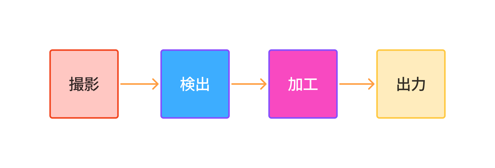
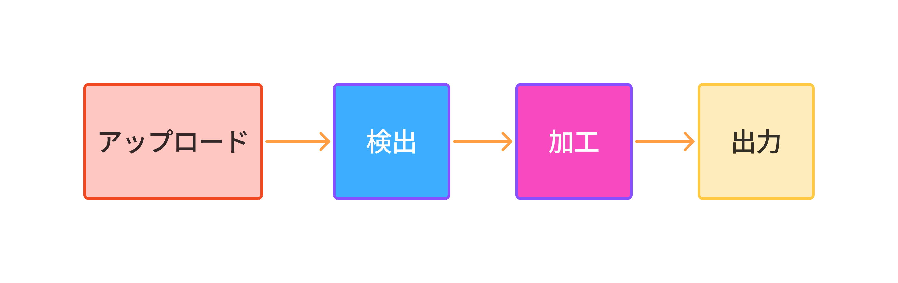

# 要件定義

## 背景
このアプリを開発した背景は、Webブラウザを搭載したデバイスで、クライアントサイドで完結して動作する写真加工アプリケーションが必要になったからである。

## 目標
このアプリの目標はスマートフォンやタブレットなどのモバイルアプリやPCなどの機器からブラウザ上で動作するウェブアプリにすること。ReactやWebGL、WebAssembly、TensorFlowなどの技術を活用し、スムーズな動作を目指す。

## UX (ユーザー体験)
このアプリに求められるUX(ユーザー体験)はローカルに保存されている写真や、その場で撮影した写真をクライアントサイドで処理・加工し、出力することである。処理の流れは以下のようになっている。

## 主な機能
このアプリの主な機能は次のようになっている。
- 背景透過
- 顔の検出
- 顔ごとのパーツの検出
- 検出された顔とその顔ごとのパーツ加工
- ユーザーによるペンやスタンプによる描画処理
- 以上の工程を経て処理された画像の出力